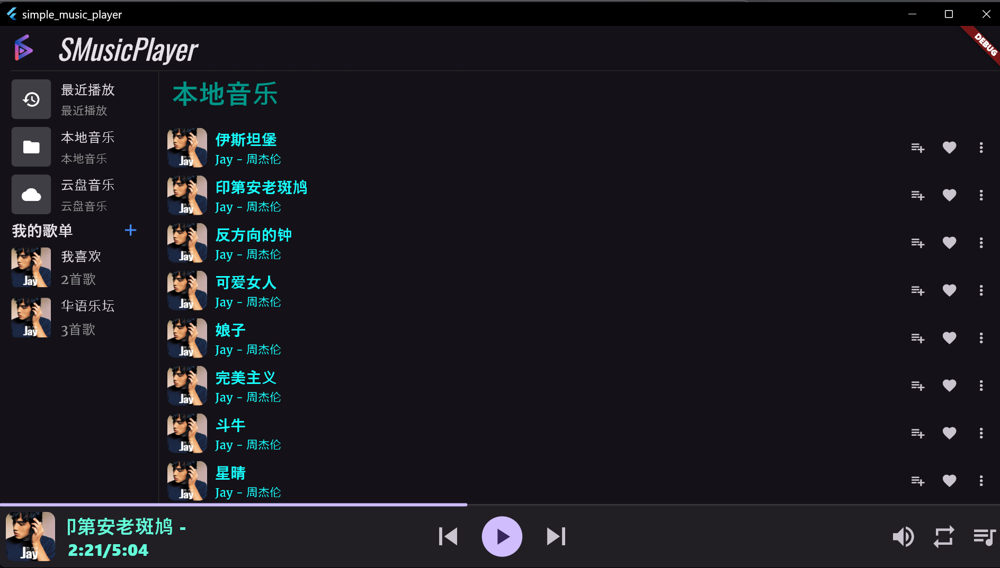
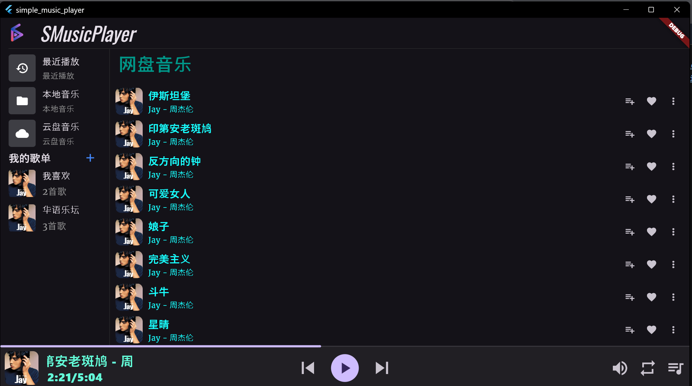
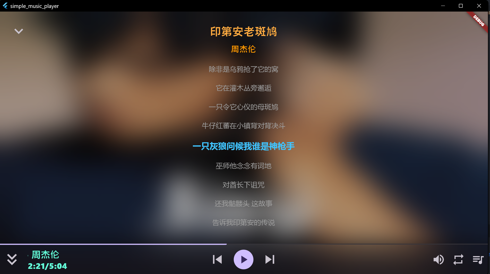
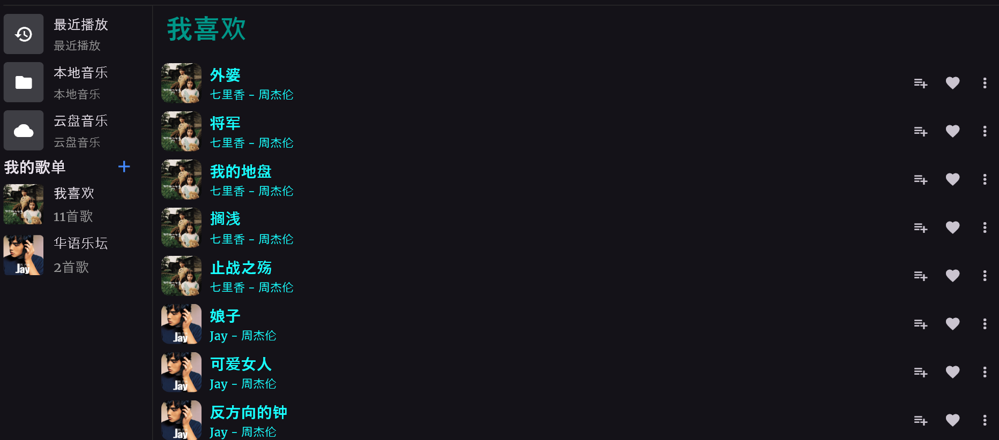
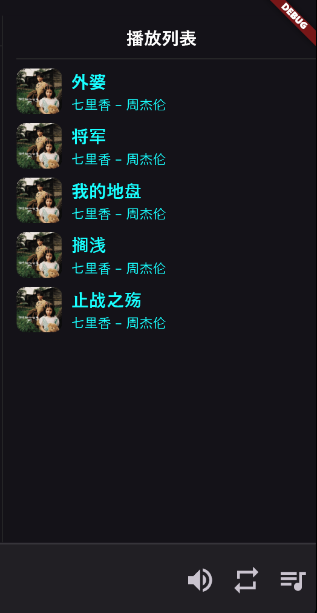

# 🎉SMusicPlayer

‼️本项目没有release，未经过打包测试，如需release请自行打包！！！源代码仅供有基础的同学交流学习，请谨慎使用！！！

这是一个基于[Flutter](https://flutter.cn/)开发框架的本地音乐播放器。应用遵循官方[MVVM](https://docs.flutter.cn/app-architecture/guide)架构建议，使用[provider](https://pub.dev/packages/provider)管理应用状态，使用路由管理页面跳转。使用[audioplayers](https://pub.dev/packages/audioplayers)解析和播放音频文件。

## 🔖 `main: Ver0.1` 主要功能如下：

**📁本地音乐**

扫描和解析本地音频文件，获取歌曲封面和歌词等元数据

**☁️云盘音乐**

使用WebDAV协议从[坚果云](https://jianguoyun.com/)根目录 `/MyMusics`目录下读取音频文件

> 注意应用会首先将歌曲缓存至本地，每次点击云盘音乐进行增量缓存或者删除来保证与云盘音乐文件的一致性

**📝歌词界面**

可以查看歌曲详细信息，如歌手、歌词等。支持滚动歌词和歌词拖动

> ⚠️注意查看歌曲详细信息需要歌曲内嵌歌曲元数据，可以使用[Mp3tag](https://www.mp3tag.de/index.html)为歌曲添加元数据

**✨歌单管理**

 

创建自定义歌单并将歌曲添加至歌单中

**📌播放历史**

自动记录最近播放的歌曲

**🔉音量控制**

应用内音量控制

**📜播放列表**

将歌曲添加至播放列表

**🔁播放模式切换**

控制播放列表内歌曲播放模式
